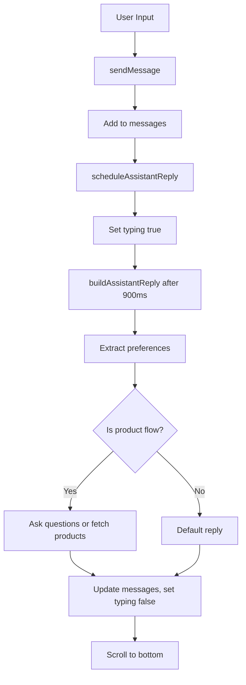
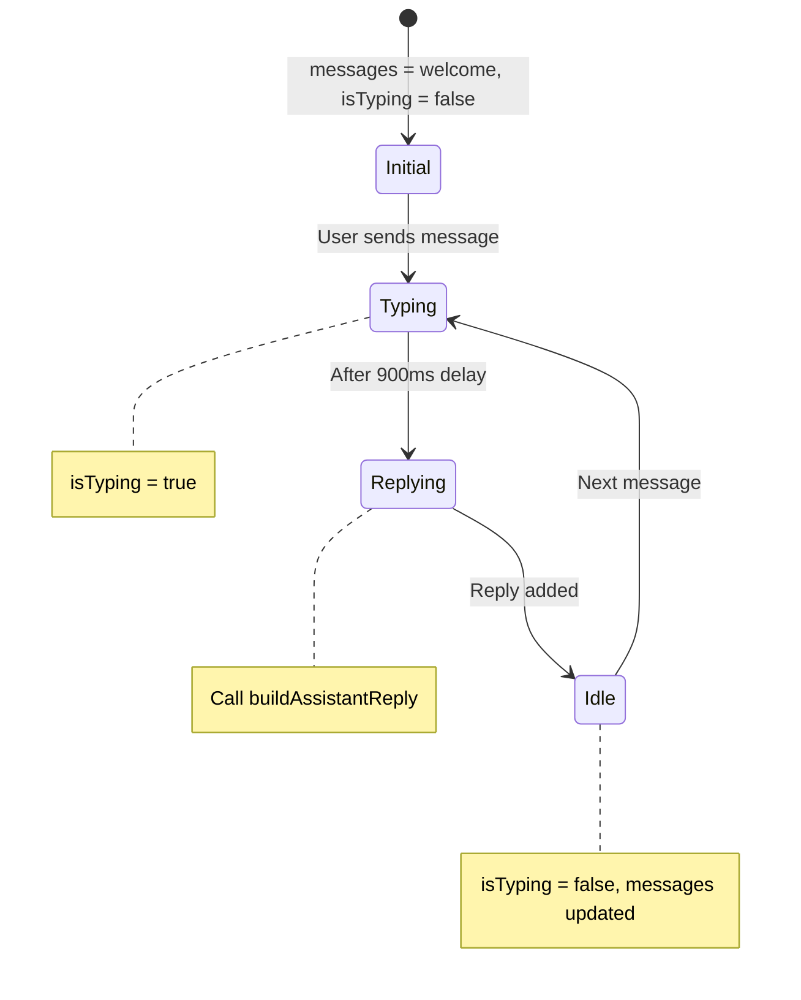

# Overview

The `ChatBox.tsx` component serves as the primary chat interface for the jewelry chat interface MVP. It is a React component written in TypeScript that manages conversational interactions between the user and an AI stylist, providing personalized jewelry recommendations and advice. The component handles message display, user input, image uploads, and integrates with product suggestion services to deliver a seamless chat experience.

**Purpose**: To facilitate user-AI conversations for jewelry consultation, product discovery, and personalized suggestions within the MVP.

**Language**: TypeScript with React.

**High-level behavior**: Renders a chat UI with message history, prompt suggestions, and an input composer. Processes user messages to extract preferences, asks clarifying questions, and fetches/suggests products via API calls. Includes typing indicators and image upload functionality.

# Implementation Details

## Core Logic

- Manages state for messages, input, typing status, user preferences, and product flow.
- Uses refs for scrolling, file inputs, timeouts, and cleanup.
- Processes user messages to extract jewelry preferences (material, category, occasion, budget) using regex and keyword matching.
- Implements a conversational flow: greet → extract prefs → ask questions → suggest products.
- Integrates with `productService` to fetch suggestions based on preferences.

## Key Components

- `ChatLayout`: Layout wrapper for messages, prompts, and composer.
- `MessageBubble`: Displays individual messages with text/images.
- `PromptCard`: Quick-select prompts for common queries.
- `Carousel`: For displaying prompt suggestions.

## Execution Flow

1. Initialize with welcome messages.
2. User sends message (text/image).
3. Extract preferences from text.
4. If in product flow, ask clarifying questions or fetch suggestions.
5. Schedule AI reply with 900ms delay (typing simulation).
6. Update messages and scroll to bottom.
7. For product suggestions, call API and update context.

## Patterns

- State management with hooks (useState, useEffect, useRef).
- Async operations for API calls and timeouts.
- Event handling for form submission and file uploads.
- Cleanup on unmount to revoke object URLs and clear timeouts.

## Error Handling

- Catches errors in product fetching, logs to console, returns empty array.
- Validates input (trims, checks for content).

## Performance Considerations

- Uses refs to avoid re-renders.
- Scrolls smoothly to new messages.
- Revokes object URLs on cleanup to prevent memory leaks.

## Security Considerations

- File uploads restricted to images.
- No direct user input sanitization beyond trimming.

# Dependencies

## Internal Dependencies

- `ChatLayout` (`@/components/chat/ChatLayout`): Layout component.
- `MessageBubble` (`@/components/chat/MessageBubble`): Message display.
- `PromptCard` (`@/components/chat/PromptCard`): Prompt cards.
- Carousel components (`@/components/ui/carousel`): UI carousel.
- `chatTheme` (`@/lib/theme/chatbox`): Theming utilities.
- `cn` (`@/lib/utils`): Class name utility.
- `Product`, `UserPreferences` (`@/lib/types/product`): Type definitions.
- `productService` (`@/lib/services/productService`): API service for products.
- `useProductContext` (`@/lib/context/ProductContext`): Context hook.

## External Dependencies

- React hooks (useState, useEffect, useRef).
- Node.js types for timeouts.

## Dependency Graph (Depth 2)

- ChatBox.tsx
  - ChatLayout
    - (layout internals)
  - MessageBubble
  - PromptCard
  - Carousel (shadcn/ui)
  - chatTheme
  - productService
    - (API calls, likely fetch or axios)
  - ProductContext

# Visual Diagrams

## Message Flow Diagram

## State Management Diagram

# Additional Insights

## Animation Flow

- Upload button: Ping animation (0.6s ease-out) when active, triggered by click with 500ms timeout.
- No other animations; relies on child components for message bubbles.

## MVP Illustration

The ChatBox embodies the core conversational AI feature of the MVP:

- **User Journey**: Select prompt → Chat with AI → Receive tailored advice → Get product suggestions.
- **Key Features**: Preference extraction, question flow, image upload, typing simulation.
- **Value Proposition**: Makes jewelry shopping interactive and personalized.

Potential improvements: Add message bubble animations, integrate real AI for replies, enhance preference extraction with NLP.

# Metadata

- **Analysis Date**: November 6, 2025
- **Depth**: 2 (primary file + direct dependencies)
- **Files Touched**: ChatBox.tsx, productService.ts, ProductContext.tsx
- **Entry Point Type**: Component (React functional component)

# Next Steps

- Analyze `productService.ts` for API integration details.
- Review `MessageBubble.tsx` for display logic.
- Test preference extraction accuracy.
- Consider adding animations to message appearance.
- Commit the knowledge file.
