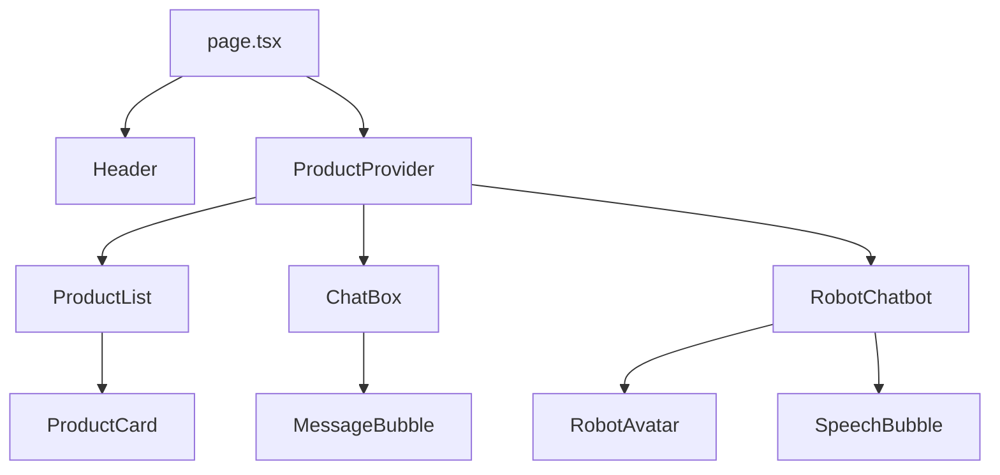

# Knowledge: Page

## Overview

The `page.tsx` file serves as the main entry point for the jewelry design MVP application. This Next.js page component implements a split-screen layout featuring product browsing on the left and an AI-powered chatbot interface on the right. The application enables users to discover existing jewelry products and generate custom AI-designed jewelry through conversational interaction.

**Language**: TypeScript/React  
**Framework**: Next.js 14+  
**Key Features**: Product discovery, AI chatbot integration, AI-generated product creation, customization workflow

## MVP Project Flow

The jewelry design MVP follows a progressive enhancement flow:

### 1. Initial Product Discovery

- **Entry**: User lands on the page showing recently viewed products (static jewelry items)
- **Display**: Product carousel with images, prices, and basic info
- **Purpose**: Familiar browsing experience to engage users

### 2. AI Suggestion Trigger

- **Trigger**: After scrolling through products, animated robot chatbot appears
- **Prompt**: Offers to switch to AI mode for custom design generation
- **Decision**: User can accept AI suggestions or continue browsing

### 3. Conversational Product Discovery

- **Interface**: Right panel chatbox with AI stylist
- **Interaction**: User describes preferences, AI probes for requirements
- **Suggestions**: AI searches and displays similar existing products via `artifact.type === "product_suggestions"`
- **Implementation**: ChatBox component parses API response artifacts and updates `suggestedProducts` in context
- **Fallback**: If no matches found, AI offers to generate custom designs

### 4. AI Product Generation

- **Generation**: AI creates 2D/3D jewelry designs based on user description
- **Display**: Generated products shown in carousel with "AI Generated" badges
- **Features**: Unique designs not available in static catalog

### 5. Product Customization

- **Selection**: User selects AI-generated product for customization
- **Options**: Modify material (gold karat), stone type, color variations
- **Regeneration**: AI creates new images based on customization selections
- **Dynamic Images**:
  - Ruby stone selection → displays `Gemini_Generated_Image_r6p3hcr6p3hcr6p3.png`
  - Diamond stone selection → displays `Gemini_Generated_Image_7uj7ao7uj7ao7uj7.png`
- **Preview**: Real-time image updates with selected options

### 6. Preorder Process

- **Transition**: User proceeds to preorder page with selected/customized product via dedicated button
- **Details**: Customer information, shipping, payment method selection
- **Completion**: Order submission with confirmation

## Implementation Details

### Core Structure

The page uses a simple flex layout divided into two equal-width sections:

- **Left Panel**: Product display and robot chatbot overlay
- **Right Panel**: Full-height chat interface

### Component Integration

- `Header`: Navigation and branding
- `ProductList`: Product carousel with AI mode switching
- `RobotChatbot`: Animated chatbot for AI generation prompts
- `ChatBox`: Main conversational interface with API integration

### State Management

The page relies on `ProductContext` for global state management, including:

- Product suggestions and AI-generated products
- Chatbot visibility and mode switching
- Loading states and customization selections

## Dependencies

### Direct Imports

- `Header` - Navigation component
- `ProductList` - Product display and interaction
- `ChatBox` - AI conversation interface
- `RobotChatbot` - Animated chatbot overlay

### Indirect Dependencies (Depth 1-3)

- **UI Components**: Button, Dialog, Carousel (shadcn/ui)
- **Context**: ProductContext for state management
- **Hooks**: useConversation for chat API integration
- **Services**: chatApi for backend communication
- **Types**: Product, AIGeneratedProduct interfaces
- **Data**: Static product data and AI product examples

### External Systems

- **Backend API**: Localhost:8000 for chat and product generation
- **Image Storage**: External URLs for product images
- **Authentication**: JWT token for API access

## Visual Diagrams

### Application Flow

```
User Entry → Product Carousel → Chatbot Prompt → AI Conversation
    ↓              ↓                    ↓              ↓
Static Products → Scroll Complete → Accept AI → Product Suggestions
    ↓              ↓                    ↓              ↓
AI Generation → Customization → Regenerate → Preorder
```

### Component Hierarchy

```
page.tsx
├── Header
├── ProductList
│   ├── Product Cards (Static/AI)
│   ├── CustomizationView
│   └── RobotChatbot
└── ChatBox
    ├── MessageBubble
    ├── PromptCard
    └── TypingDots
```

## Additional Insights

### Key Patterns

- **Progressive Enhancement**: Starts with static products, escalates to AI generation
- **Context-Driven UI**: Components adapt based on AI mode and product state
- **Real-time Updates**: Chat messages and product suggestions update dynamically
- **Error Handling**: Graceful fallbacks for API failures and image loading

### Performance Considerations

- Lazy loading of product images
- Debounced chatbot triggers
- Optimistic UI updates for chat messages
- Context-based component rendering

### Security Notes

- API tokens stored in client code (development only)
- No sensitive data in client state
- Image URLs validated on error

### Potential Improvements

- Implement proper authentication flow
- Add product caching and offline support
- Enhance error boundaries and retry logic
- Optimize bundle size for production

## Metadata

**Analysis Date**: November 13, 2025  
**Depth**: 3 levels  
**Files Touched**: 15+ components, hooks, services, and types  
**Key Entry Points**: page.tsx, ProductList.tsx, ChatBox.tsx, useConversation.ts, CustomizationView.tsx
**Recent Updates**: Added preorder button integration, implemented product suggestion parsing from chat API, added dynamic image selection based on stone type in customization

## Next Steps

- Review `ProductList.tsx` for detailed product display logic
- Examine `useConversation.ts` for chat API integration patterns
- Analyze `CustomizationView.tsx` for product modification workflow
- Investigate preorder flow in `/preorder/[productId]/page.tsx`

# Dependencies

## Internal Dependencies

- `Header` (`@/components/Header`): Header component.
- `ProductList` (`@/components/ProductList`): Product display component.
- `ChatBox` (`@/components/ChatBox`): Chat interface component.
- `RobotChatbot` (`@/components/RobotChatbot`): Animated chatbot component.
- `ProductProvider` (`@/lib/context/ProductContext`): Context provider for product and chatbot state.

## External Dependencies

- `framer-motion`: Used in `RobotChatbot` for entrance, exit, and collapse/expand animations.
- Next.js/React: Framework for rendering.

## Dependency Graph (Depth 2)

- page.tsx
  - ProductProvider
    - ProductContext (manages chatbot, products, AI mode)
  - Header
  - ProductList
    - Carousel (shadcn/ui)
    - ProductCard
  - ChatBox
    - ChatLayout
    - MessageBubble
    - PromptCard
    - Carousel
  - RobotChatbot
    - RobotAvatar
    - SpeechBubble
    - ChatbotButtons
    - framer-motion

# Visual Diagrams

## Layout Diagram



## Animation Flow

```mermaid
stateDiagram-v2
    [*] --> Invisible
    Invisible --> Visible: Initial load
    Visible --> Collapsed: User clicks close
    Collapsed --> Expanded: User clicks avatar
    Expanded --> Invisible: User agrees to AI mode
    note right of Visible : Spring animation: opacity 0→1, scale 0.8→1, y 20→0
    note right of Collapsed : Speech bubble hidden
    note right of Expanded : Speech bubble animates in: opacity 0→1, x -20→0, scale 0.8→1
```

# Additional Insights

## Animation Flow

- **RobotChatbot Entrance**: Uses Framer Motion's `motion.div` with spring transition (stiffness 300, damping 25, duration 0.5s). Animates from opacity 0, scale 0.8, y 20 to full visibility.
- **Collapse/Expand**: The speech bubble and buttons animate with spring (stiffness 400, damping 25, duration 0.3s) for smooth show/hide.
- **ChatBox**: Minor animation for upload indicator (ping effect).
- **ProductList**: Loading spinner with CSS `animate-spin`.

## MVP Illustration

The MVP demonstrates a jewelry e-commerce interface with AI integration:

- **User Journey**: Browse products → Interact with chat → Receive suggestions → View AI-generated designs.
- **Key Features**: Product carousel, conversational AI, animated chatbot for engagement.
- **Value Proposition**: Personalized jewelry recommendations via chat, enhancing shopping experience.

Potential improvements: Add more animations for message bubbles, integrate real AI backend, improve responsiveness.

# Metadata

- **Analysis Date**: November 13, 2025
- **Depth**: 3 levels
- **Files Touched**: page.tsx, RobotChatbot.tsx, ChatBox.tsx, ProductList.tsx, ProductContext.tsx, useConversation.ts, chatApi.ts, CustomizationView.tsx
- **Entry Point Type**: File (Next.js page component)

# Next Steps

- Deeper analysis of `ChatBox` logic for message handling and product suggestion flow.
- Review `ProductContext` for state management patterns.
- Consider adding animations to `ChatBox` message bubbles for better UX.
- Test the animation flows in different screen sizes.
- Commit the knowledge file to version control.
