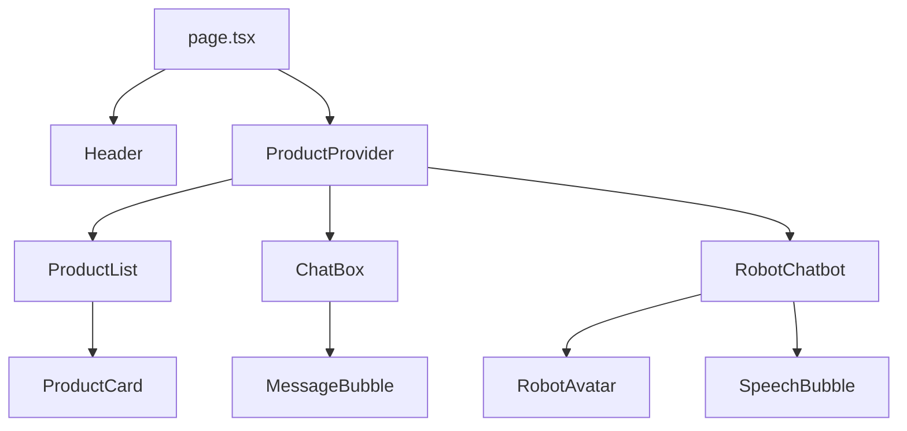

# Overview

The `page.tsx` file serves as the main entry point for the jewelry chat interface MVP application. It is a Next.js page component written in TypeScript that renders the home screen of the app. The app is designed as a jewelry shopping interface where users can browse products and interact with an AI-powered chatbot to receive personalized product suggestions, including AI-generated jewelry designs.

**Purpose**: To provide the primary user interface for the MVP, integrating product display, chat functionality, and animated chatbot interactions.

**Language**: TypeScript with React (Next.js framework).

**High-level behavior**: Upon loading, the page displays a header, a list of jewelry products on the left half, a chat box on the right half, and a floating robot chatbot that can suggest AI-generated products. The layout is responsive and uses animations to enhance user experience.

# Implementation Details

## Core Logic

- The component wraps the entire UI in a `ProductProvider` context, which manages global state for products, chatbot visibility, and AI mode.
- The layout uses Flexbox: a full-height flex column with the header at the top, and a flex row below containing the product list/chatbot on the left (50% width) and the chat box on the right (50% width).
- No complex logic; primarily declarative rendering of child components.

## Key Components

- `Header`: Displays the app's header (likely navigation or branding).
- `ProductList`: Renders a list of static jewelry products with images, prices, and a carousel for suggestions.
- `ChatBox`: A chat interface for user interaction with the AI stylist, including message bubbles, prompts, and product suggestions.
- `RobotChatbot`: An animated floating chatbot that appears at the bottom-left, offering to switch to AI mode and suggest generated products.

## Execution Flow

1. Page loads and renders the layout.
2. `ProductList` displays static products.
3. `ChatBox` initializes with welcome messages from the AI stylist.
4. `RobotChatbot` animates in, allowing users to agree to AI suggestions or collapse it.
5. User interactions in the chat or chatbot trigger state changes via the context.

## Patterns

- Uses "use client" directive for client-side rendering.
- Context API for state management.
- Tailwind CSS for styling.
- Framer Motion for animations in child components.

## Error Handling

- Minimal error handling visible; relies on child components for validation (e.g., chat input).

## Performance Considerations

- Next.js optimizes images and rendering.
- Animations are lightweight using Framer Motion springs.

## Security Considerations

- No sensitive data handling; client-side app with static/product data.

# Dependencies

## Internal Dependencies

- `Header` (`@/components/Header`): Header component.
- `ProductList` (`@/components/ProductList`): Product display component.
- `ChatBox` (`@/components/ChatBox`): Chat interface component.
- `RobotChatbot` (`@/components/RobotChatbot`): Animated chatbot component.
- `ProductProvider` (`@/lib/context/ProductContext`): Context provider for product and chatbot state.

## External Dependencies

- `framer-motion`: Used in `RobotChatbot` for entrance, exit, and collapse/expand animations.
- Next.js/React: Framework for rendering.

## Dependency Graph (Depth 2)

- page.tsx
  - ProductProvider
    - ProductContext (manages chatbot, products, AI mode)
  - Header
  - ProductList
    - Carousel (shadcn/ui)
    - ProductCard
  - ChatBox
    - ChatLayout
    - MessageBubble
    - PromptCard
    - Carousel
  - RobotChatbot
    - RobotAvatar
    - SpeechBubble
    - ChatbotButtons
    - framer-motion

# Visual Diagrams

## Layout Diagram



## Animation Flow

```mermaid
stateDiagram-v2
    [*] --> Invisible
    Invisible --> Visible: Initial load
    Visible --> Collapsed: User clicks close
    Collapsed --> Expanded: User clicks avatar
    Expanded --> Invisible: User agrees to AI mode
    note right of Visible : Spring animation: opacity 0→1, scale 0.8→1, y 20→0
    note right of Collapsed : Speech bubble hidden
    note right of Expanded : Speech bubble animates in: opacity 0→1, x -20→0, scale 0.8→1
```

# Additional Insights

## Animation Flow

- **RobotChatbot Entrance**: Uses Framer Motion's `motion.div` with spring transition (stiffness 300, damping 25, duration 0.5s). Animates from opacity 0, scale 0.8, y 20 to full visibility.
- **Collapse/Expand**: The speech bubble and buttons animate with spring (stiffness 400, damping 25, duration 0.3s) for smooth show/hide.
- **ChatBox**: Minor animation for upload indicator (ping effect).
- **ProductList**: Loading spinner with CSS `animate-spin`.

## MVP Illustration

The MVP demonstrates a jewelry e-commerce interface with AI integration:

- **User Journey**: Browse products → Interact with chat → Receive suggestions → View AI-generated designs.
- **Key Features**: Product carousel, conversational AI, animated chatbot for engagement.
- **Value Proposition**: Personalized jewelry recommendations via chat, enhancing shopping experience.

Potential improvements: Add more animations for message bubbles, integrate real AI backend, improve responsiveness.

# Metadata

- **Analysis Date**: November 6, 2025
- **Depth**: 2 (primary file + direct dependencies)
- **Files Touched**: page.tsx, RobotChatbot.tsx, ChatBox.tsx, ProductList.tsx, ProductContext.tsx
- **Entry Point Type**: File (Next.js page component)

# Next Steps

- Deeper analysis of `ChatBox` logic for message handling and product suggestion flow.
- Review `ProductContext` for state management patterns.
- Consider adding animations to `ChatBox` message bubbles for better UX.
- Test the animation flows in different screen sizes.
- Commit the knowledge file to version control.
