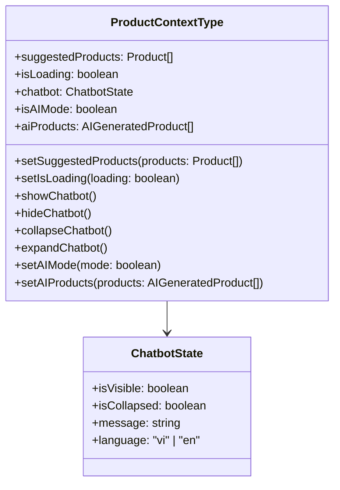
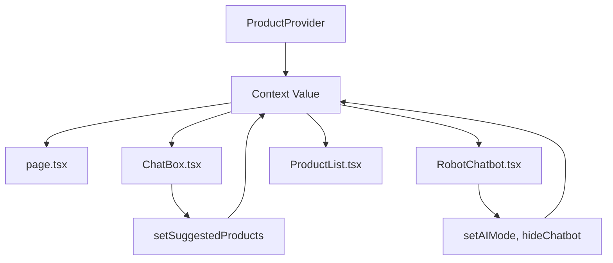

# Overview

The `ProductContext.tsx` file defines a React context for managing global state related to products, chatbot interactions, and AI features in the jewelry chat interface MVP. It is a TypeScript file that provides a provider component and a custom hook to access and update state across the application, enabling seamless data flow between components like the chat interface, product lists, and robot chatbot.

**Purpose**: To centralize state management for product suggestions, chatbot behavior, and AI mode, avoiding prop drilling and ensuring consistent data sharing in the MVP.

**Language**: TypeScript with React.

**High-level behavior**: Wraps the app with a context provider that holds state for suggested products, loading status, chatbot visibility/collapse, AI mode, and AI-generated products. Provides methods to update these states.

# Implementation Details

## Core Logic

- Defines interfaces for `ChatbotState` and `ProductContextType`.
- Uses `useState` for multiple state variables: suggested products, loading, AI mode, AI products, chatbot state.
- Provides functions to manipulate chatbot: show, hide, collapse, expand.
- Context provider wraps children and supplies the value object.

## Key Components

- `ProductProvider`: Context provider component.
- `useProductContext`: Custom hook to consume the context.

## Execution Flow

1. App wraps with `ProductProvider`.
2. Components use `useProductContext` to access state.
3. State updates trigger re-renders in consuming components.
4. Chatbot functions modify the chatbot state object.

## Patterns

- React Context API for global state.
- Custom hooks for type-safe context consumption.
- Immutable state updates with spread operators.
- Error boundary with throw in hook if context undefined.

## Error Handling

- Throws error if `useProductContext` used outside provider.

## Performance Considerations

- State updates cause re-renders; no memoization visible.
- Suitable for small app; may need optimization for larger scale.

## Security Considerations

- Client-side state; no server-side persistence.

# Dependencies

## Internal Dependencies

- `Product`, `AIGeneratedProduct` (`../types/product`): Type definitions.

## External Dependencies

- React: `createContext`, `useContext`, `useState`, `ReactNode`.

## Dependency Graph (Depth 2)

- ProductContext.tsx
  - Product types
- Consumers: page.tsx, ChatBox.tsx, RobotChatbot.tsx, ProductList.tsx, etc.

# Visual Diagrams

## State Structure Diagram

## Data Flow Diagram

# Additional Insights

## Animation Flow

- No direct animations; provides state that controls animations in consuming components (e.g., chatbot visibility triggers animations in RobotChatbot).

## MVP Illustration

The ProductContext is the backbone of state management in the MVP:

- **User Journey**: App loads → Context initializes → Components interact via context → State updates drive UI changes.
- **Key Features**: Centralized product data, chatbot control, AI mode toggle.
- **Value Proposition**: Enables dynamic product suggestions and chatbot interactions without complex prop passing.

Potential improvements: Add persistence (localStorage), integrate with backend for real-time sync, add reducers for complex state logic.

# Metadata

- **Analysis Date**: November 6, 2025
- **Depth**: 2 (primary file + direct dependencies)
- **Files Touched**: ProductContext.tsx, product.ts (types)
- **Entry Point Type**: Context (React context provider)

# Next Steps

- Analyze consumer components for usage patterns.
- Consider adding state persistence.
- Test context performance with many updates.
- Review type definitions for completeness.
- Commit the knowledge file.
