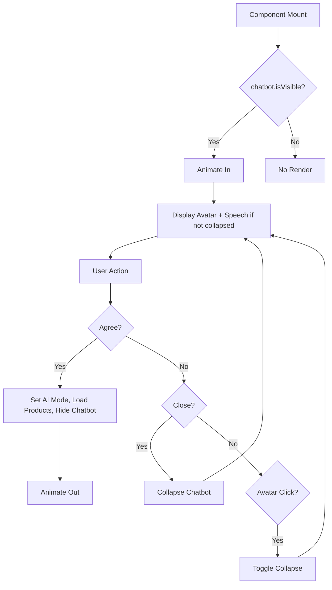
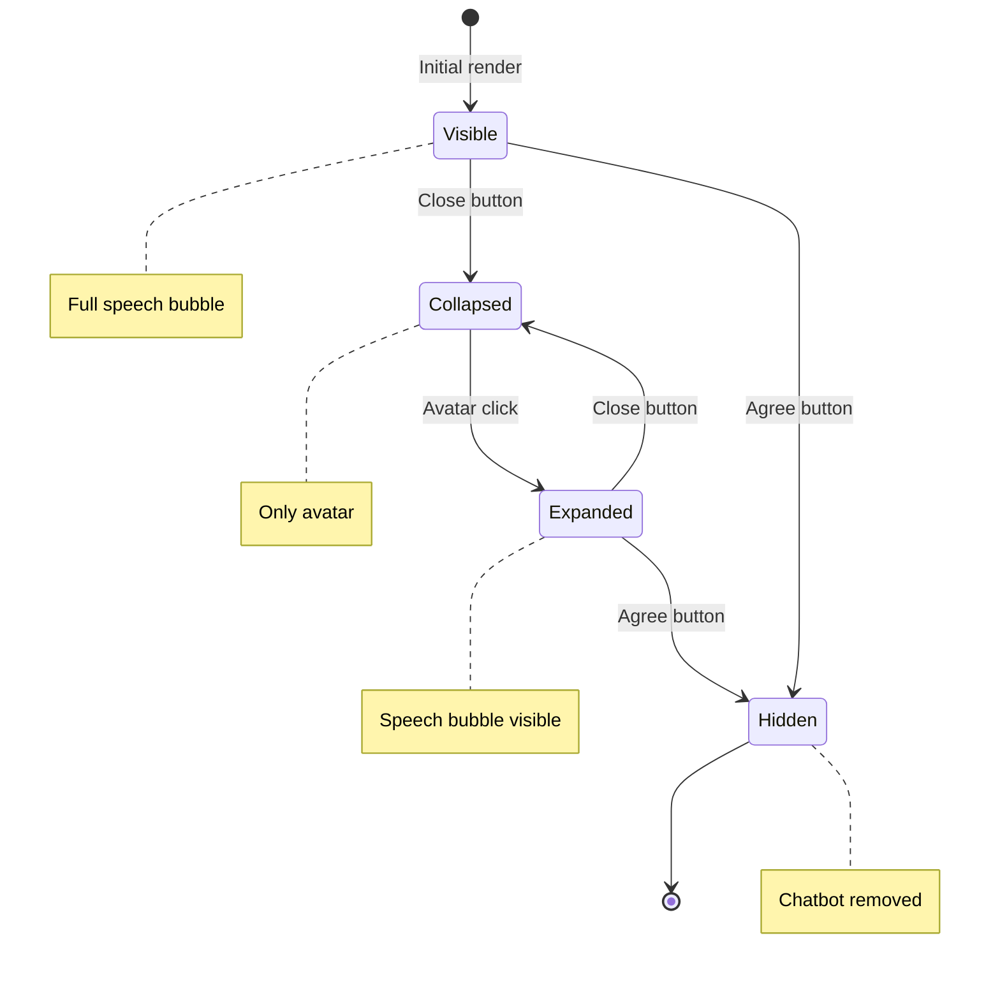

# Overview

The `RobotChatbot.tsx` component implements a floating, animated chatbot interface for the jewelry chat interface MVP. It is a React component written in TypeScript that provides an interactive robot avatar with speech bubbles and action buttons, allowing users to engage with AI-generated product suggestions. The component uses Framer Motion for smooth animations and integrates with the product context to manage chatbot state and AI mode activation.

**Purpose**: To create an engaging, animated chatbot that prompts users to switch to AI-powered product recommendations, enhancing user interaction and onboarding to the AI features of the MVP.

**Language**: TypeScript with React.

**High-level behavior**: Renders a fixed-position chatbot that animates in/out, can be collapsed/expanded, and triggers AI mode with product suggestions when the user agrees.

# Implementation Details

## Core Logic

- Uses `useProductContext` to access and modify chatbot state (visibility, collapse, AI mode, products).
- Handles user interactions: agree (activates AI mode, sets AI products, hides chatbot), close (collapses chatbot).
- Avatar click toggles collapse state.
- Conditionally renders based on visibility and collapse state.

## Key Components

- `RobotAvatar`: Displays the robot image, passes collapse state.
- `SpeechBubble`: Shows the chatbot's message.
- `ChatbotButtons`: Agree and close buttons.

## Execution Flow

1. Component mounts, checks context for visibility.
2. If visible, animates in with spring transition.
3. User can click avatar to expand/collapse speech bubble.
4. Agree button: sets AI mode, loads AI products, hides chatbot.
5. Close button: collapses the chatbot.

## Patterns

- Conditional rendering with `AnimatePresence`.
- Animation variants for entrance/exit and collapse/expand.
- Event handlers for user actions.
- Context integration for state management.

## Error Handling

- No explicit error handling; relies on context and animation library.

## Performance Considerations

- Uses Framer Motion's optimized animations.
- Fixed positioning minimizes layout shifts.

## Security Considerations

- No user input; only button clicks.

# Dependencies

## Internal Dependencies

- `RobotAvatar` (`./RobotAvatar`): Avatar component.
- `SpeechBubble` (`./SpeechBubble`): Speech bubble display.
- `ChatbotButtons` (`./ChatbotButtons`): Action buttons.
- `aiProducts` (`../lib/data/aiProducts`): AI-generated product data.
- `useProductContext` (`../lib/context/ProductContext`): Context hook.

## External Dependencies

- `motion`, `AnimatePresence` from `framer-motion`: Animation library.

## Dependency Graph (Depth 2)

- RobotChatbot.tsx
  - RobotAvatar
  - SpeechBubble
  - ChatbotButtons
  - aiProducts (static data)
  - ProductContext
    - State management for chatbot and products

# Visual Diagrams

## Animation Flow Diagram

## State Transitions

# Additional Insights

## Animation Flow

- **Entrance/Exit**: `motion.div` with `initial`, `animate`, `exit` props. Spring transition: stiffness 300, damping 25, duration 0.5s. Animates opacity (0→1), scale (0.8→1), y (20→0).
- **Collapse/Expand**: Inner `motion.div` for speech bubble/buttons. Spring: stiffness 400, damping 25, duration 0.3s. Animates opacity (0→1), x (-20→0), scale (0.8→1).
- Purpose: Smooth, bouncy animations to draw attention and provide feedback.

## MVP Illustration

The RobotChatbot is a key engagement element in the MVP:

- **User Journey**: Page loads → Chatbot appears → User interacts → Switches to AI suggestions.
- **Key Features**: Animated presence, collapsible UI, AI mode trigger.
- **Value Proposition**: Guides users to discover AI-generated products, enhancing the novelty of the app.

Potential improvements: Add more personality (e.g., different messages), integrate with chat for seamless flow, add sound effects.

# Metadata

- **Analysis Date**: November 6, 2025
- **Depth**: 2 (primary file + direct dependencies)
- **Files Touched**: RobotChatbot.tsx, RobotAvatar.tsx, SpeechBubble.tsx, ChatbotButtons.tsx, ProductContext.tsx
- **Entry Point Type**: Component (React functional component)

# Next Steps

- Analyze `RobotAvatar.tsx` for avatar rendering.
- Review `ProductContext.tsx` for state management.
- Test animation performance on different devices.
- Consider adding more interactive animations.
- Commit the knowledge file.
